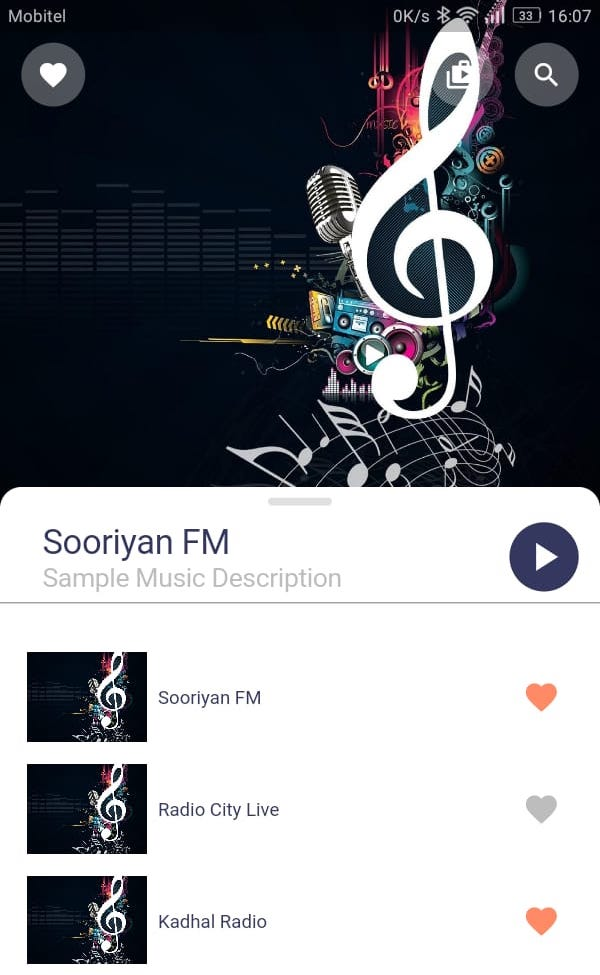
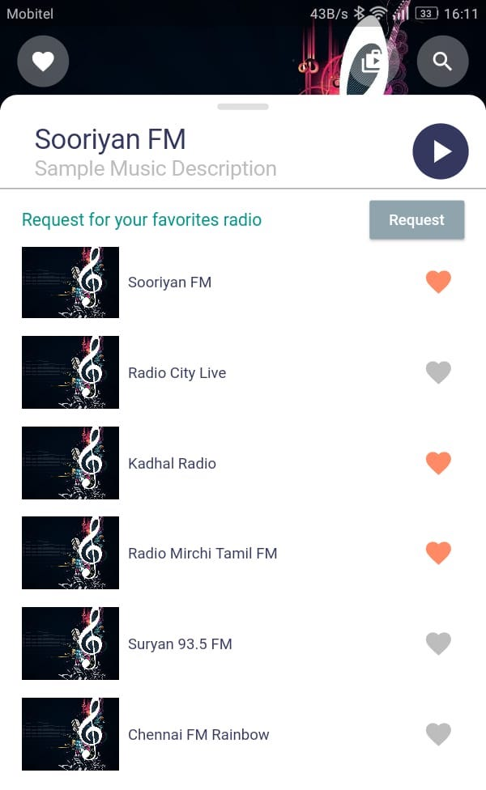
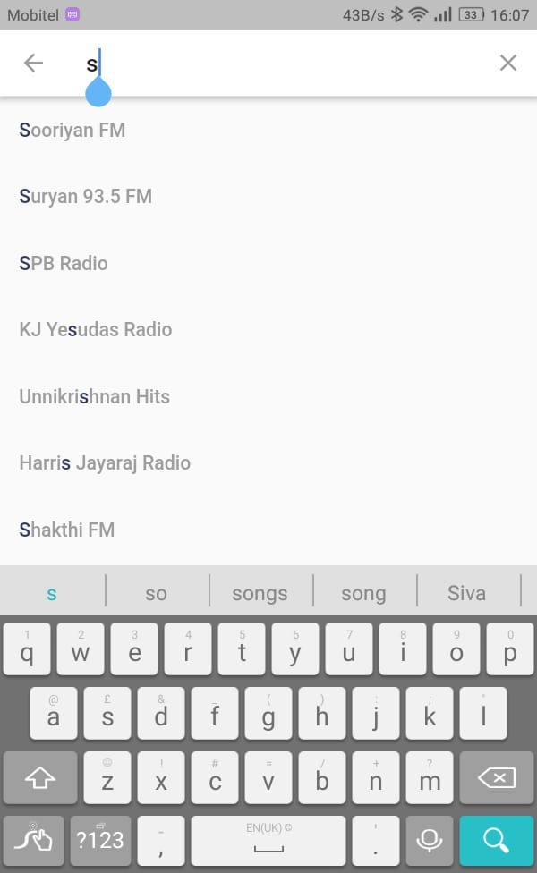

# Flutter Music Player UI

A Material designed music player developed in Flutter.

## Getting Started

This project is a starting point for a Flutter application.

A few resources to get you started if this is your first Flutter project:

- [Lab: Write your first Flutter app](https://flutter.dev/docs/get-started/codelab)
- [Cookbook: Useful Flutter samples](https://flutter.dev/docs/cookbook)

For help getting started with Flutter, view our
[online documentation](https://flutter.dev/docs), which offers tutorials,
samples, guidance on mobile development, and a full API reference.

## ❤️ Contributing
Bug reports and pull requests are welcome on GitHub

### Screenshots

### License

This project is released under the [MIT license](LICENSE). You can use the code for any purpose, including commercial projects.

 